# powerbi_example

## Sobre o projeto

Esse projeto possui um exemplo, construído através do Power BI, de dashboard. A pasta models é utilizado para armazenar as dashboards. A pasta samples é utilizada para armazenar os arquivos, onde os dados são importados.

## Como visualizar o exemplo

Execute o arquivo da pasta models

ou

Inicie o Power BI. Iniciando o Power BI, no menu, selecione: File => Open. Vá na pasta do projeto e em models selecione o arquivo de exemplo.

## Power BI Tutorial

Tutorial de como utilizar o Power BI

### Importanto dados

no menu "Home", clique em "Get Data"

Selecione o extensão do arquivo a ser trabalhado, por exemplo, csv, xls(Excel), json, pdf ...

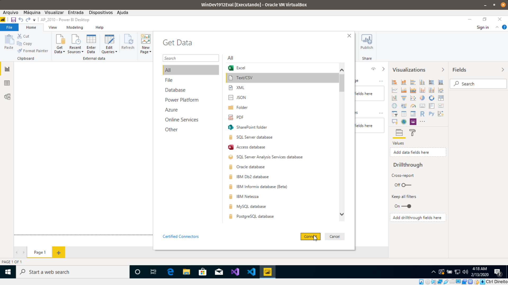

Selecione a sample ou arquivo, onde os dados serão importados.

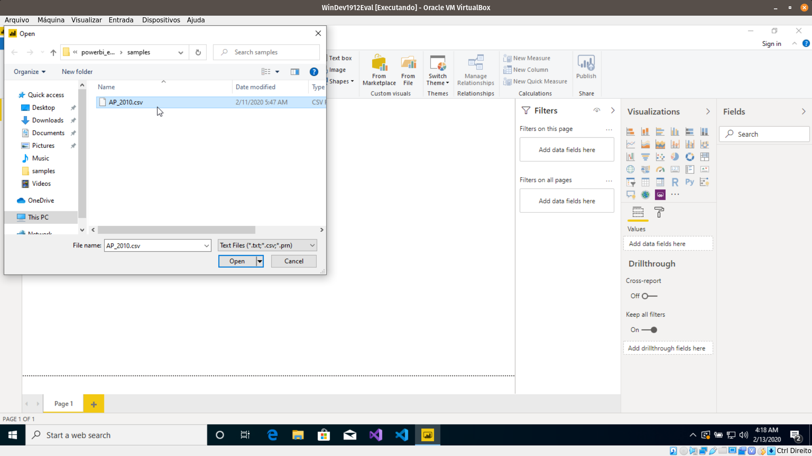

Aparecerá uma tela com a pré-visualização dos dados. Confirme clicando em "Load".

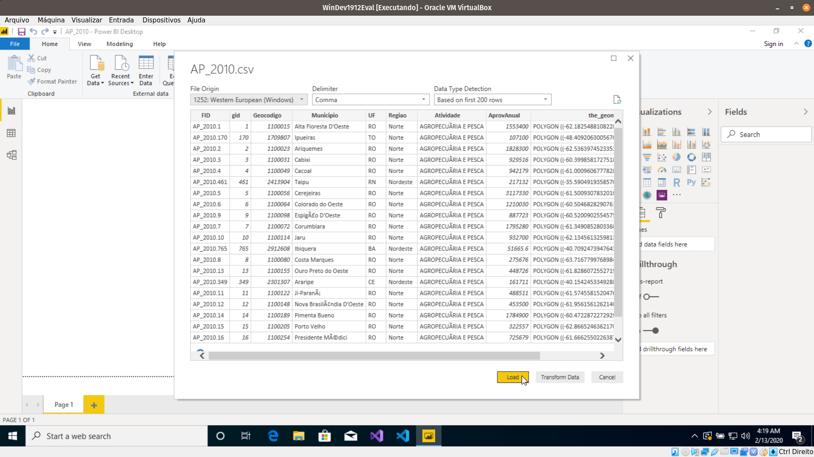

No canto direito em Fields aparecerá a tabela com as chaves dos dados importados.

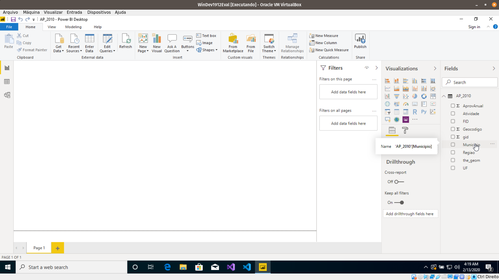

### Entendendo os Dados

No canto inferior esquerdo existe um botão com nome "Data". Esse menu mostra todos os dados importados em forma de tabela. É útil para entender as relações que os dados possuem antes de inserir algum gráfico.

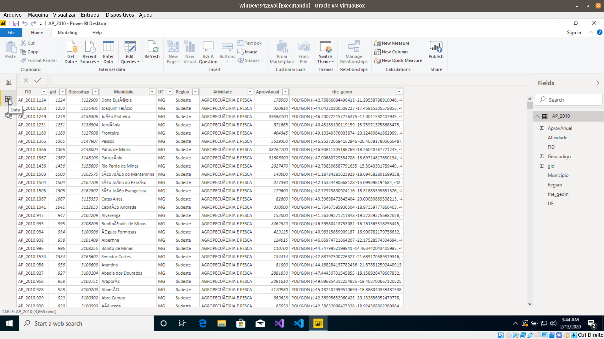

### Gráficos

No menu Vizualizations clique no gráfico de sua escolha.

Depois de selecionar, será possível escalonar o gráfico na tela a vontade.

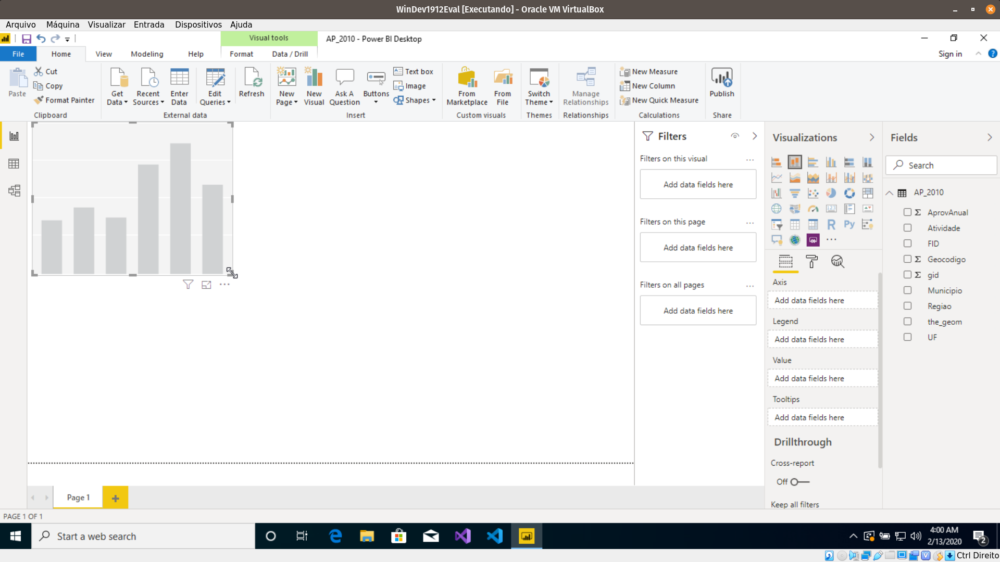

### Inserindo os dados importados nos Gráficos

Em sua dashboard, selecione um dos gráficos. Depois de selecionar, no campo Fields marque os atributos que você deseja representar no gráfico selecionado.

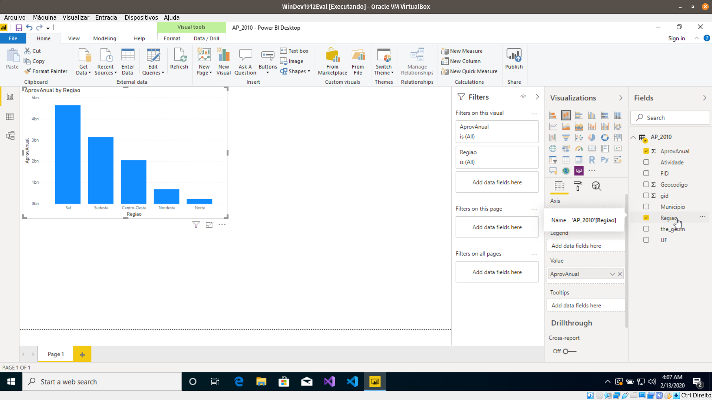

OBS: Ao marcar atributos sem selecionar nenhum gráfico resultará em uma criação de gráfica automática pelo Power BI.

No campo "Legends" é possível definir quais atributos vão nas linhas, colunas e legendas
do gráfico, por exemplo, se arrastamos o atributo "Atividades" até legenda, temos:

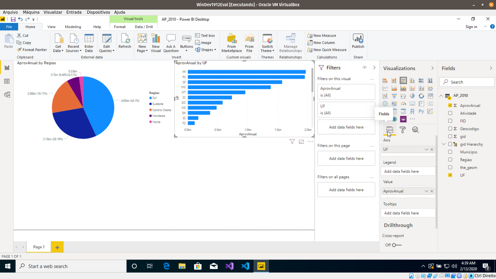
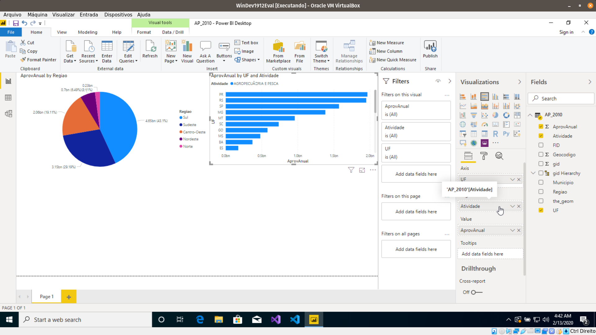

Agora, o nosso gráfico, o da direita. aparece com a legenda de Atividades, indicando as atividades de cada estado e seu valor de orçamento.

### Formatando o Gráfico

É possível mudar algumas informações do gráfico a partir do menu "Format" em Vizualizations.

Aqui, alteramos a cor da legenda do mapa a direita, mas existem um número grande de opções como: remoção de título, legenda, adição de controles de zoom, etc ...;

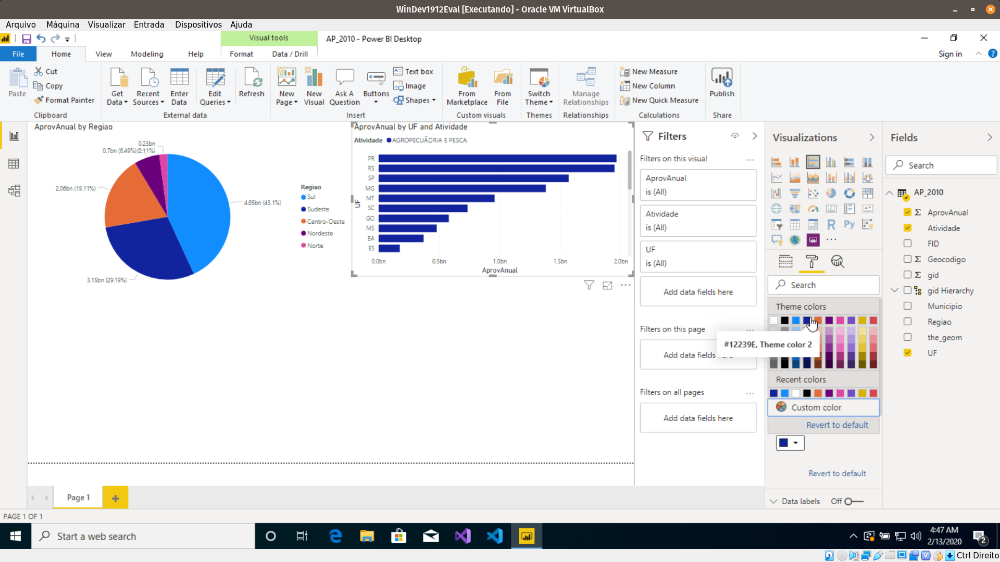

### Interagindo com o Dashboard

O dashboard possui interações entre o gráficos. Neste exemplo, Selecionando uma região diretamente no gráfico da esquerda, resulta, no gráfico da direita, o realce do orçamento dos estados daquela região.

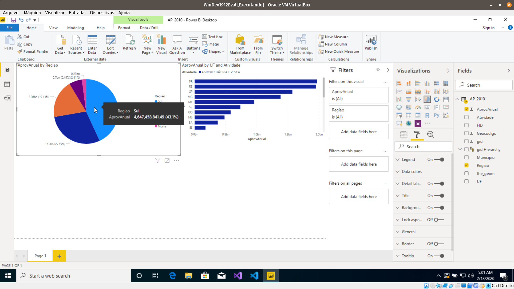
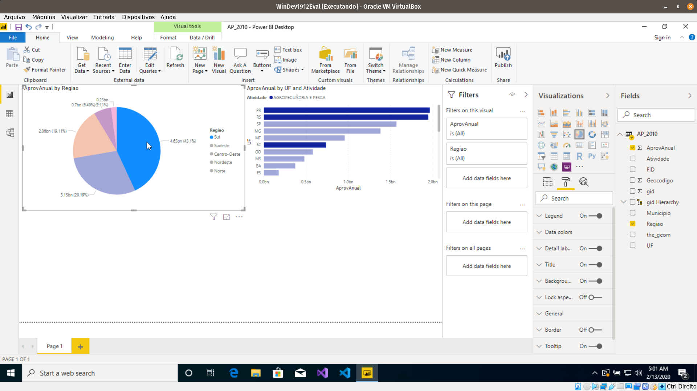

### Aplicação de Filtros

No campo "Filters" fazer algumas pesquisa nos atributos para mostrar no dashboard.
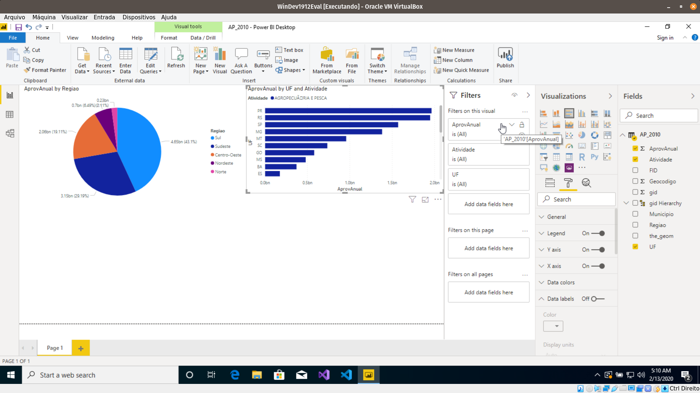

Em Filters clique no atributo escolhido para aplicação do filtro. Depois, construa a lógica do Filtro

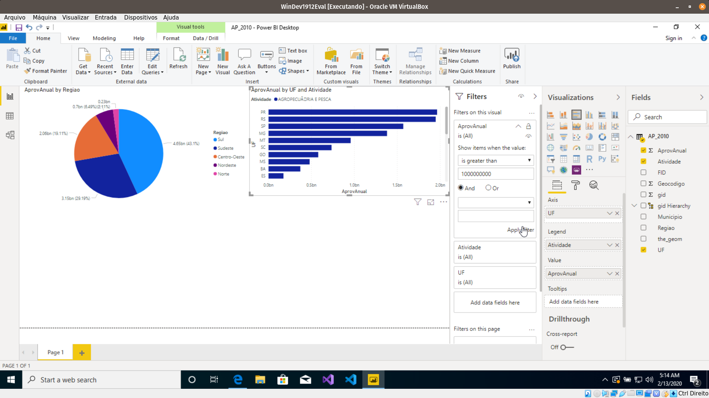

Aplique e veja o resultado.
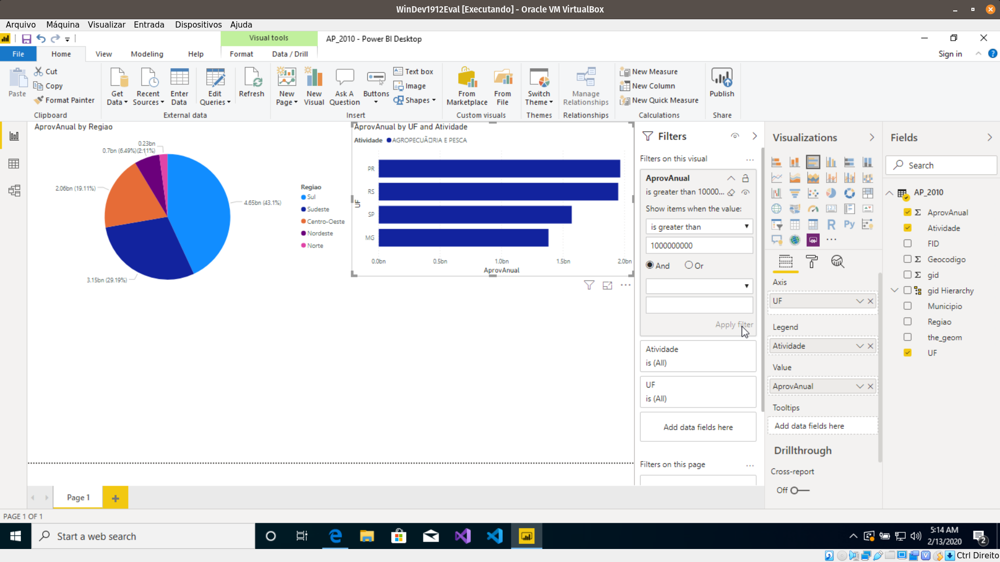
